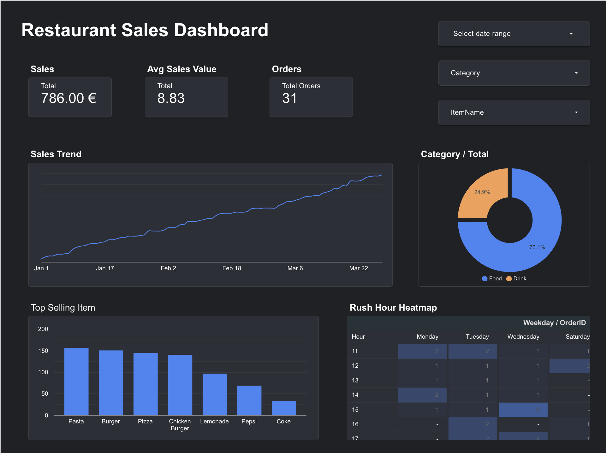

# Restaurant-Sales-Dashboard
An interactive restaurant sales dashboard built with Google Sheets and Looker Studio to track revenue, top items, rush hours, and sales trends.

This project is a comprehensive restaurant sales analytics dashboard built using **Google Sheets** and **Looker Studio**.

It enables restaurant owners and analysts to track performance through interactive visualizations including:
- 💰 **Total Revenue, Average Order Value, and Total Orders**
- 🍽️ **Top-Selling Items** segmented by Food and Drink
- 🔥 **Rush Hour Heatmap** by Hour and Weekday
- 📈 **Sales Trends** over time
- 🥧 **Category-wise Revenue Breakdown**

---

## 🔗 Live Dashboard

👉 [View the live Looker Studio report](https://lookerstudio.google.com/reporting/77b61a83-1caa-42b5-aa63-d5e2fb89101e)

---

## 📁 Files Included

- `Restaurant_Sales_Dashboard.pdf` – Snapshot of the final dashboard
- `sample-data.xlsx` – Simulated restaurant order data (Jan–Mar 2025)
- `screenshots/` – Visual previews of the dashboard sections

---

## 🛠️ Tools Used

- **Google Sheets** – Data collection and preprocessing
- **Looker Studio (Data Studio)** – Visualization and interactive dashboard
- **GitHub** – Project documentation and sharing

---

## 🖼️ Preview

---

## 📅 Project Scope

This dashboard was designed to:
- Identify high-revenue time slots
- Analyze top-performing menu items
- Optimize restaurant staffing by understanding customer patterns
- Provide a reusable template for other hospitality data dashboards

---

## 👤 Author

**Kanak Yadav**  
GitHub: [@kanak2208](https://github.com/kanak2208)

---

## 📜 License

MIT License – feel free to reuse and customize with credit.
